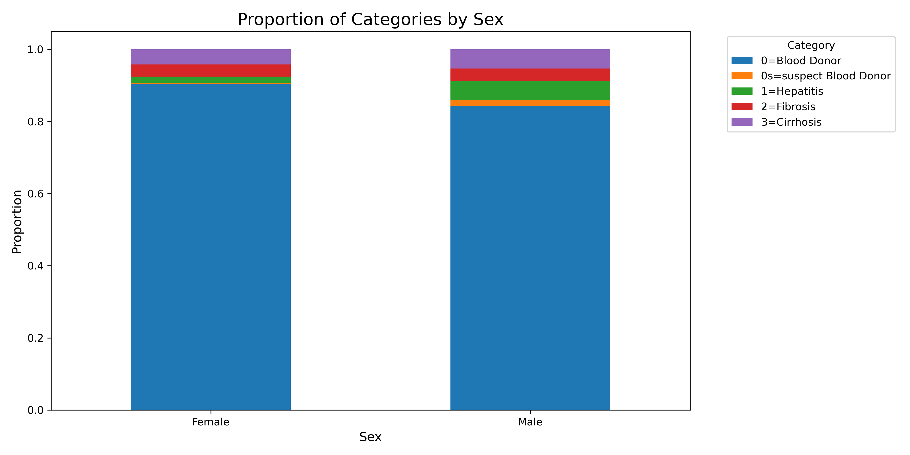

# Blood Donor Classification Project Report

### Data Science Institute at Brown University

### Jimmy Lin

### Github Repository: https://github.com/sirjimmylin/DATA-1030-Project.git

## Introduction 

### Motivation
Blood donor classification is crucial for healthcare systems to ensure the safety and efficiency of blood donation processes. Accurate classification models can help identify suitable donors and optimize resource allocation.

### Dataset Description
The dataset includes features such as Age, ALB, AST, and others, with the target variable being Category, which classifies individuals into groups like "0=Blood Donor" and "1=Hepatitis". The dataset consists of 615 samples and 12 features.

### Previous Work
This dataset came from a German research team, who used machine learning techniques (specifically decision trees), to predict and confirm that laboratory tests can be useful for detecting liver fibrosis and cirrhosis. However, the team made it clear that medical experts are still necessary for determining decision trees for diagnoses. 

## Exploratory Data Analysis (EDA) 

##### Figure 1. Male donors are more likely to have hepatitis.

##### Figure 2. Albumin, a protein made by the liver, is unsurprisingly linked to total protein levels.

##### Figure 3. Bilirubin levels are high in patients with cirrhosis. 

### Target Variable Distribution
- Visualize the distribution of the target variable (`Category`).
- Discuss any class imbalance observed.

### Feature Distributions
- Include visualizations such as box plots or violin plots for key features grouped by `Category`.
- Present histograms showing the distribution of continuous features.

### Correlations
- Calculate and visualize correlations between features using a heatmap.
- Highlight any strongly correlated features that might impact modeling.

### Missing Data
- Report the percentage of missing values for each feature.
- Describe how missing data was handled (e.g., imputation, reduced-features model).

## Methods 

### Splitting Strategy
Since the dataset is heavily imbalanced, it is important to ensure that the smaller classes are represented in each split.
Employing a stratified splitting strategy ensures that the smaller classes will be present in each split. 

The first split involved defining a custom `StratifiedSplit` function to split the data into the test set of data, and the remaining data was placed into an 'other' dataset.

Following this split into a 'test' and 'other' set, I employed `StratifiedKFold` to split the 'other' set into training and validation sets. The function that I defined can be called so that you can input a custom number of splits or folds into the dataset. For this project, I set the number of splits equal to 4, the random state to 42, and the test size to 0.2. 

The resulting split data is 60% train, 20% validation, and 20% test.

### Data Preprocessing
Once the data is split into train, test, and validation sets, the next step is to ensure that the data is preprocessed before running any machine learning models. For this project, a `ColumnTransformer` was used to preprocess the data. Categorical data were encoded using `LabelEncoder` , `OneHotEncoder`, while the preprocessing pipeline scaled continuous features using `StandardScaler` and the age feature using `MinMaxScaler`. 

### ML Pipeline
Once the data is preprocessed, machine learning models can then be run on it. Four  models (Reduced Features Model with Logistic Regression, Reduced Features Model with Support Vector Classifier, XGBoost, and Random Forest Classifier) were implemented with GridSearchCV for hyperparameter tuning with cross-validation.

### Evaluation Metric
For this model, I have chosen to optimize for false negatives, since I have decided that missing a diagnosis for a patient that has hepatitis is greater than the cost associated with running extra tests and procedures. However, I do not want to completely ignore the costs associated with false positives, so I have decided that opting for an $f_2$ score serves as a way to weight recall more heavily, while not entirely discarding precision in my analysis. The dataset is also imbalanced, so a metric like accuracy does not make much sense. Moreover, this imbalance also means that it is best to find an averaging metric that takes the different weights into account, so I decided to use the weighted $f_2$ score.

### Hyperparameter Tuning

| Machine Learning Model | Hyperparameter | Values |
|------------------------|----------------|--------|
| Reduced Features with SVC | C | 0.1, 1, 10 |
| | gamma | scale, auto |
| | kernel | linear |
| Reduced Features with Logistic Regression | C | 0.01, 1, 100 |
| | solver | liblinear, saga |
| | max_iter | 100000 |
| | class_weight | balanced |
| | penalty | l1, l2 |
| | tol | 0.0001, 0.001 |
| XGBoost | max_depth | 3, 5, 7 |
| | n_estimators | 100, 200 |
| | learning_rate | 0.01, 0.1 |
| | subsample | 0.8, 1.0 |
| | colsample_bytree | 0.8, 1.0 |
| Random Forest Classifier | n_estimators | 100, 200 |
| | max_depth | None, 10 |
| | min_samples_split | 2, 5 |
| | min_samples_leaf | 1, 2 |
| | max_features | sqrt, log2 |

##### Table 1: ML Models and their Corresponding Hyperparameters

### Uncertainty Measurement
Uncertainties due to data splitting can be measured by running different random states over the dataset during preprocessing and over the different ML models. 

Similarly, uncertainties due to non-deterministic methods (e.g. Random Forest) can be measured by training the model multiple times using different random seeds.

In both cases, the evaluation metric (i.e. $f_2$ weighted) will vary between random states and random seeds. These differences constitute the uncertainties due to data splitting and non-deterministic methods.

## Results 

### Baseline Comparison
The baseline $f_2$ weighted metric is 0.845. Of the models tested, the highest performing model is XGBoost, with a mean of 0.945. This calculates to 4.76 standard deviations above the baseline.

### Model Performance

##### Figure 4. Different ML Models and Associated F2 Weighted Scores.
- Summarize the performance of all models in a table:

| Model               | Subset   |   F2 Weighted Score | Standard Deviation |
|---------------------|----------|--------------------|--------------------|
| SVC                 | Subset 1 |          0.9640            | ±0.0123            |
| Logistic Regression | Subset 1 |       0.9235            | ±0.0156            |
| XGBoost             | Full Set |          0.9411            | ±0.0203            |

### Feature Importances

#### Global Feature Importance
Determining the most important features globally involved running multiple different global feature importances, including permutation importance, and XGBoost metrics. 

##### Figure 5. Being female was the strongest feature by permutation feature importance, followed by Protein levels.

Figure 5 shows the top 10 most important features from permutation feature importance. Using permutation feature importance, the difference in test score was calculated as a result of randomly
shuffling a feature’s value. 

Figure 6 shows the most important features according to the XGBoost metric weight, while Figure 7 shows the most important features according to the gain metric.

##### Figure 6. AST (Aspartate Aminotransferase) is the most important feature according to the XGBoost Weight metric.

##### Figure 7. CHE (Cholinesterase) is the most important feature according to the XGBoost Gain metric.

### Discussion
While there are some contradictory signs of feature importance, there are a few main takeaways. 

Consistently across various metrics, cholinesterase and aspartate aminotransferase rank highly. Aspartame aminotransferase is an enzyme indicating liver damage, so it is not surprising that it has a high impact on the models for predicting hepatitis, a liver disease. Cholinesterase is an enzyme involved in fat processing, which while not immediately clear how it is linked to liver health, points to its role in overall health.

Age and albumin were found to have a low impact on the predictive power of ML models. These results are a bit surprising as age is correlated with disease progression for many chronic diseases, while albumin, a protein made by the liver that binds to free bilirubin, is generally thought of as important for reducing toxic bilirubin in the body. Further investigation is needed in this area.

## Outlook 

### Model Improvements
Moving forward, there are a few different ways to improve the model's predictive power. During the model training process, the `class_weight` hyperparameter was added to improve the convergence of the Reduced Features Model with Logistic Regression. Since the dataset is imbalanced, predictive power is likely to increase for the ML models once the weight of various classes are taken into account. Extensive feature engineering and feature selection could also boost predictive power by linking related features together.

### Interpretability Improvements
SHAP is a key tool that was not successfully utilized in analyzing feature importance. Successful implementation of SHAP would improve the interpretability of both global and local feature importances. Local feature importance can also be addressed through the implementation of LIME metrics.

### Weaknesses in Approach
A key limitation in the approach is the small sample size for minority classes. While this dataset comes with its limitations, more research should be done with more robust datasets to ensure that the small sample size does not skew the results too heavily.

## References (5 points)

1. Lichtinghagen, Ralf, Frank Klawonn, and Georg Hoffmann. "HCV data." UCI Machine Learning Repository, 2020, https://doi.org/10.24432/C5D612.
2. Hoffmann, Georg F. et al. “Using machine learning techniques to generate laboratory diagnostic pathways—a case study.” Journal of Laboratory and Precision Medicine (2018): n. pag.

